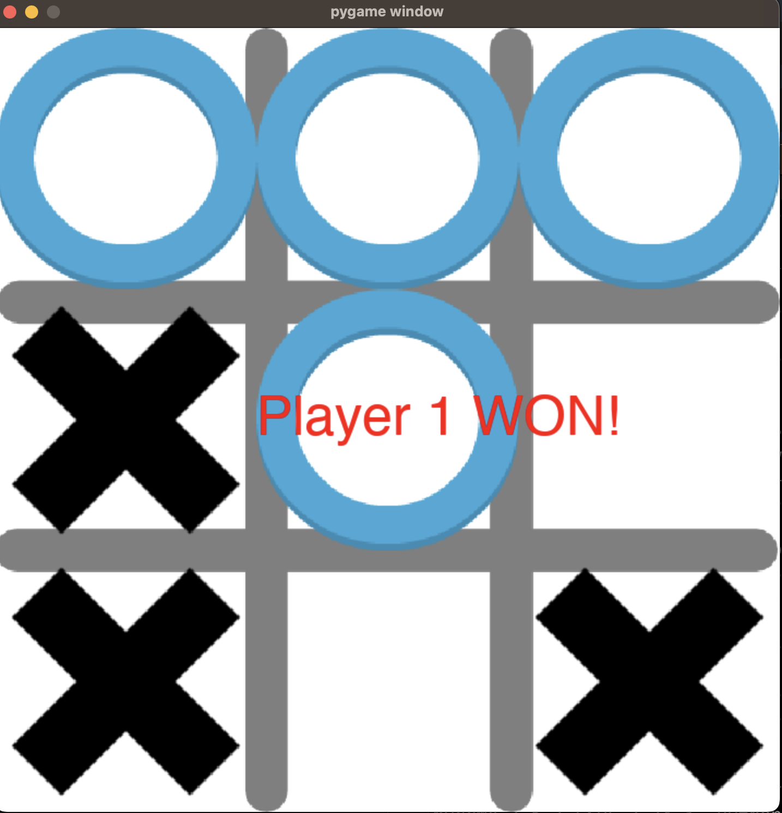

# Tic-Tac-Toe Game

This is a simple Tic-Tac-Toe game implemented in Python using the `pygame` library.

## Table of Contents
- [Installation](#installation)
- [Running the Game](#running-the-game)
- [How to Play](#how-to-play)
- [License](#license)



## Installation

To run this project, you'll need Python and the `pygame` library. You can set up the project using the following steps:

1. Clone the repository:

    ```sh
    git clone https://github.com/yourusername/ticTacToe.git
    cd ticTacToe
    ```

2. Create a virtual environment and activate it:

    ```sh
    python3 -m venv venv
    source venv/bin/activate  # On Windows use `.\venv\Scripts\activate`
    ```

3. Install the required dependencies:

    ```sh
    pip install -r requirements.txt
    ```

## Running the Game

Once the dependencies are installed, you can run the game using:

```sh
python main.py
